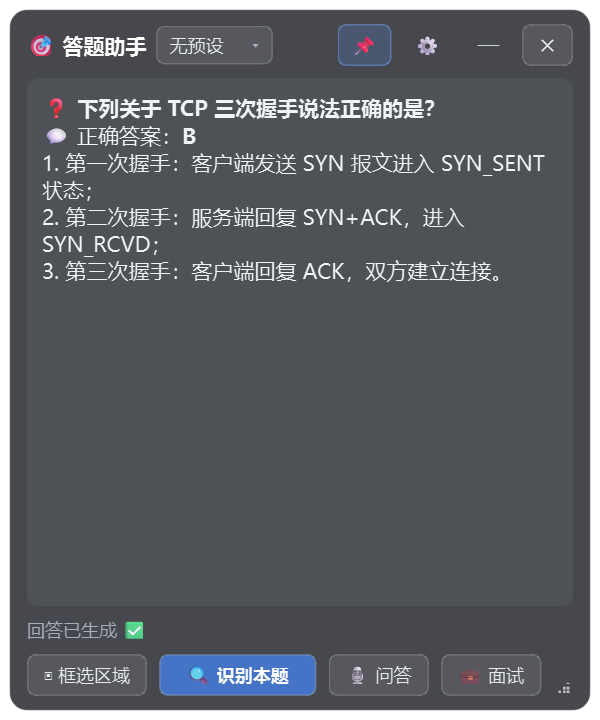
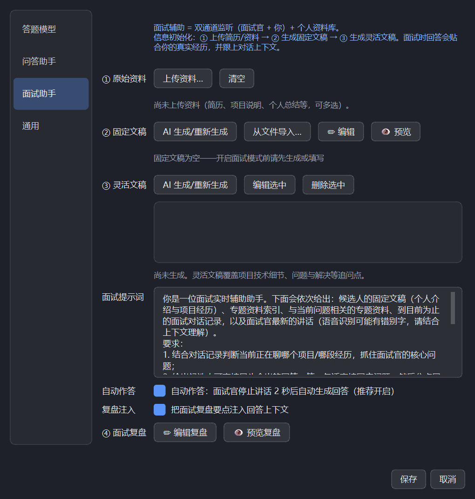

# 答题助手

一个 Windows 桌面小工具：**框选屏幕上的题目区域，一键截图发送给多模态大模型，实时显示答案**。
半透明悬浮窗 + 全局快捷键，全程无需把鼠标移出浏览器页面。



## 📖 文档导航

- 🚀 下文：[功能特性](#功能特性) · [快速开始](#快速开始) · [配置教程](#配置教程以-kimi-为例) · [使用教程](#使用教程) · [故障排除](#故障排除)
- 📘 [设置 · 答题模型](docs/settings-model.md)：多模态模型、供应商模板、获取模型列表、思考模式、我的预设
- 📗 [设置 · 问答助手](docs/settings-qa.md)：语音识别（本地模型/云端 API）、连通测试、问答提示词
- 📙 [设置 · 面试助手](docs/settings-interview.md)：资料库初始化、双通道监听、自动作答、复盘与一键优化
- 📕 [设置 · 通用](docs/settings-general.md)：快捷键、透明度、沉浸式、实时思考、兼容隐身、持续优化

## 功能特性

- 📷 **区域截图识别**：首次框选一个固定区域，之后每次识别都自动截取该区域
- 🎙 **问答助手模式**：监听电脑音频输出（会议中对方的讲话），实时语音转文字，一键生成口语化回答
- 💼 **面试辅助**：个人资料库（固定文稿+灵活文稿）+ 双通道监听（面试官和你），面试官静默 3 秒自动组织回答，多轮追问也能跟上上下文
- 🛡 **语音防噪**：语气词/杂音自动过滤不进上下文；长句中顿自动延长等待；"听不清请重问"自动改用上一个完整问题重试；扬声器回声自动剔除
- 🔄 **资料库持续优化**：面试结束自动保存本场记录并生成 LLM 复盘（问题归类 + 回答点评 + 资料补充建议）；「一键优化资料库」按复盘建议自动增补文稿、微调回答结构
- 🗣 **本地语音识别**：内置阿里通义开源 SenseVoice 模型（随安装包附带），**完全离线、免 Key、毫秒级响应**；也可切换为云端 Whisper 兼容 API
- 🤖 **多供应商支持**：OpenAI 兼容格式（Kimi / DeepSeek / 通义千问 / GPT-4o 等）与 Anthropic（Claude）格式
- 📋 **一键获取模型列表**：填好 Base URL 和 Key 后点一下即可拉取该供应商的全部模型，不用手填
- 🧠 **思考模式**：默认开启，支持 Kimi K2 / Claude 等推理模型，更准但稍慢
- 💾 **配置预设**：多套模型配置可存为预设，标题栏下拉框或快捷键一键切换
- ⌨️ **全局快捷键**：浏览器全屏答题时无需点击本工具，按快捷键即可识别
- 👻 **屏幕共享隐身**：窗口对 getDisplayMedia / 录屏 / 屏幕共享不可见，本机显示不受影响
- 🪟 **半透明 + 置顶**：不透明度可调，可置顶，窗口大小可拖拽调整并记忆
- 🫥 **沉浸式模式**：问答/面试时鼠标离开窗口自动收缩为纯答案区，移入答案区即恢复完整界面
- 🔔 **系统托盘**：最小化到托盘，不占用任务栏

## 快速开始

### 方式一：安装包（推荐给普通用户）

1. 从 Releases 下载 `answer-assistant-setup-vX.X.X.exe` 并运行（与大多数软件一样的中文安装向导，**免管理员权限**，默认装到用户目录）
2. 安装后从开始菜单或桌面快捷方式启动，首次打开先点标题栏 **⚙** 完成模型配置（见下文）
3. 点击「▣ 框选区域」框住题目区域，之后点「🔍 识别本题」或按快捷键即可

安装包已内置本地语音识别模型，问答助手开箱即用、无需联网。

### 方式二：源码运行（推荐给开发者）

```bash
pip install -r requirements.txt
python main.py
```

要求：Windows 10 2004 及以上，Python 3.10+。
源码运行如需本地语音识别，请下载 [SenseVoice int8 模型](https://hf-mirror.com/csukuangfj/sherpa-onnx-sense-voice-zh-en-ja-ko-yue-2024-07-17) 中的 `model.int8.onnx` 与 `tokens.txt`，放到 `models/sense-voice/` 目录下（不下载则会提示改用云端 API）。

## 配置教程（以 Kimi 为例）

点击标题栏的 **⚙** 按钮打开设置：


1. **供应商模板**：选择「Kimi 开放平台」，Base URL 会自动填好
2. **API Key**：粘贴你的 Key（去 [Kimi 开放平台](https://platform.moonshot.cn) 申请）
3. **模型**：点击「**获取模型列表**」，从下拉框里选择一个**支持图片输入**的模型（如 `kimi-k2.6`）
4. **测试连接**：确认能正常调用
5. **保存**

其他供应商同理——DeepSeek 选「DeepSeek」模板（视觉模型 `deepseek-v4-flash-vision-exp`），Claude 选「Anthropic」模板并把接口格式切到 Anthropic。

### 设置项说明

设置页按左侧四个卡片组织，每个卡片都有详细文档（含使用流程与常见问题）：

- 📘 [设置 · 答题模型](docs/settings-model.md)：多模态模型、供应商模板、获取模型列表、思考模式、我的预设
- 📗 [设置 · 问答助手](docs/settings-qa.md)：语音识别（本地模型/云端 API）、连通测试、问答提示词
- 📙 [设置 · 面试助手](docs/settings-interview.md)：资料库初始化、双通道监听、自动作答、复盘与一键优化
- 📕 [设置 · 通用](docs/settings-general.md)：快捷键、透明度、沉浸式、实时思考、兼容隐身、持续优化

速查表：

| 设置项 | 说明 |
| --- | --- |
| 我的预设 | 把当前整套配置存为命名预设；多个供应商之间快速切换 |
| 供应商模板 | 预置常用供应商，选中自动填 Base URL |
| 接口格式 | OpenAI 兼容 / Anthropic，选模板时自动切换 |
| 思考模式 | 默认开启；推理模型更准但慢，普通模型可关闭提速 |
| 提示词 | 自定义给模型的答题指令，可按题型调整 |
| 识别快捷键 | 触发「识别本题」的全局快捷键 |
| 答案字号 | 答案区文字大小（10~28 px） |
| 窗口不透明度 | 50%~100%（整体淡出，含文字） |
| UI 区域背景 | 标题栏/按钮区底板的不透明度 0~100%（只影响背景，文字保持清晰） |
| 答案区背景 | 答案显示区背景的不透明度 0~100%（只影响背景） |
| UI 底板颜色 | UI 底板的颜色（取色器自选，透明度沿用「UI 区域背景」滑杆） |
| UI 字体 | UI 文字的颜色 + 不透明度（标题/状态/按钮文字统一派生） |
| 答案区背景色 | 答案区背景的颜色（取色器自选，透明度沿用「答案区背景」滑杆） |
| 答案字体 | 答案文字的颜色 + 不透明度（灰=听到/绿=我说话/红=错误等状态色不受影响） |
| 沉浸式模式 | 问答/面试时：鼠标移入答案区显示完整界面，离开窗口自动只留答案区 |
| 实时思考 | 问答/面试专用思考开关，默认关闭以压低延迟；答题/复盘仍用「思考模式」开关 |
| 兼容隐身 | Win10 2004 等旧系统隐身失效时开启（禁用半透明样式，需重启） |
| 持续优化 | 面试结束后自动保存本场记录到资料库并生成面试复盘 |
| 问答助手分组 | 语音识别来源（本地模型/云端 API）、云端 ASR 参数与问答专用提示词 |
| 面试助手分组 | 个人资料库（原始资料/固定文稿/灵活文稿/面试复盘）、面试专用提示词、自动作答与复盘注入开关 |

## 使用教程

### 基本流程

1. **框选区域**：点「▣ 框选区域」，鼠标拖选题目所在的屏幕区域（只需框一次，会记住）
2. **识别本题**：点「🔍 识别本题」或按快捷键，答案以 Markdown 显示在窗口中
3. **下一题**：网页切到下一题后，再次触发识别即可

### 全局快捷键

| 快捷键 | 功能 |
| --- | --- |
| `Ctrl+Alt+Q` | 识别本题（可在设置中改为 Ctrl+Alt+A / F9 / F10） |
| `Ctrl+Alt+S` | 顺序切换预设（切换后自动测试连接） |
| `Ctrl+Alt+C` | 清空答案区，恢复快捷键提示 |
| `Ctrl+Alt+W` | 问答/面试模式下：把识别到的讲话内容发给模型生成回答 |

### 问答助手模式（会议问答）

适用场景：腾讯会议 / 浏览器会议中的问答环节，对方口头提问时帮你快速组织回答。

1. **选择识别来源**：打开 ⚙设置 →「问答助手」分组。**默认使用内置本地模型**
   （阿里通义开源 SenseVoice，支持中英日韩粤，完全离线、免 Key、毫秒级响应，
   安装包已自带，无需任何配置）；如需改用云端服务，把「识别来源」切到
   **云端 API**，填 ASR 服务的 Base URL + Key + 模型
   （推荐 SiliconFlow 的 `FunAudioLLM/SenseVoiceSmall`，中文快且准，有免费额度；
   若答题服务商本身提供 Whisper 接口，可勾选「与答题模型同服务商」）
2. **测试**：点「测试语音识别」验证所选来源的识别链路
3. **开启监听**：点底部「🎙 问答」，助手开始监听电脑的声音输出（只采系统输出，
   不采麦克风；戴耳机同样有效）
4. **实时转写**：识别到的讲话以灰色「听到：…」滚动显示在答案区（自动滚到底部）
5. **生成回答**：听到问题后按 `Ctrl+Alt+W`（或点「💬 回答刚才的问题」），
   答案区自动清空、只显示当前问题和口语化分点回答，照着念即可
6. 再点一次「🎙 问答」关闭监听

问答助手使用独立的「问答提示词」（设置中可改），与截图答题的提示词互不影响。

### 面试辅助模式（线上面试）

适用场景：腾讯会议 / 浏览器视频面试。核心是**个人资料库 + 双通道对话跟踪**，
多轮追问也能跟上上下文（知道在聊哪个项目、你刚才说过了什么）。



#### 第一步：信息初始化（面试前做一次）

打开 ⚙设置 →「面试助手」分组，按顺序来：

1. **① 原始资料**：上传简历、项目说明、个人总结等（PDF / Word / TXT / MD，
   可多选；只提取文字，文件备份在程序目录 `profile/raw/` 下）
2. **② 固定文稿**：点「AI 生成/重新生成」，LLM 会把资料整理成
   「个人介绍 + 过往项目介绍」的固定文稿；点「✏ 编辑」「👁 预览」会在
   **Markdown 编辑器窗口**（编辑/预览/分屏三种视图，类似 Typora）中修改或查看，
   也可以点「从文件导入…」直接使用自己写好的文稿
3. **③ 灵活文稿**：点「AI 生成/重新生成」，LLM 会生成 3~8 篇专题文稿
   （每个项目的技术细节、遇到的问题与解决、可能被追问的点），
   双击列表项即可在同一个 Markdown 编辑器中逐篇修改

#### 第二步：面试进行中

1. 点底部「💼 面试」开启（自动带动「🎙 问答」）——此时**同时监听两个通道**：
   扬声器里的面试官（灰色「听到：…」）和麦克风里的你自己
   （你的讲话在答案区只显示一行「我：( 正在说话 )」轻量指示，避免刷屏；
   内容本身会完整记入对话上下文——v2.0 起连续碎段自动合并为一条，
   对话记录和复盘更干净易读）
2. **自动作答（默认开启）**：面试官停止讲话 3 秒后，助手自动整理上下文并生成
   回答；若最后一句像没说完（句末没有完整标点），自动放宽到 4 秒；
   期间面试官继续讲话会重新计时，回答生成中来了新内容也会自动跟进。
   不需要时可在设置 →「面试助手」分组取消勾选「自动作答」，改回手动按
   `Ctrl+Alt+W` 触发
3. **内置语音防噪**：语气词/杂音碎片（如"嗯"、"The."）自动过滤，不进上下文
   也不触发作答；扬声器外放造成的麦克风回声自动剔除；若模型因噪音误判
   "听不清"，会自动改用上一个完整问题重试一次
3. 每次作答时 LLM 收到的上下文包括：固定文稿全文 + 灵活文稿索引 +
   本地检索命中的专题全文 + 最近的面试对话记录 + 面试复盘要点（可在设置中关闭）
4. 每次作答前答案区自动清空，**只保留当前问题 + 回答**；所有新内容自动滚动
   到底部，回答生成完成后直接照着念即可
5. 生成的回答贴合你的真实经历，且与你说过的内容连贯（不会自相矛盾）

#### 第三步：面试结束后（资料库持续优化，默认开启）

1. 关闭面试模式或退出程序时，本场完整记录（面试官提问 + 你的口述 +
   AI 建议）自动保存到资料库 `sessions/` 目录，并自动生成**面试复盘**：
   问题清单归类 + 回答质量点评 + 资料补充建议。
   v2.0 起**任何退出方式都会先落盘**：标题栏 X、托盘退出、Alt+F4、
   任务栏右键关闭、系统关机均会先保存面试记录再退出；
   v2.1 起真退出（标题栏 X / 托盘退出）**保证秒退**——复盘不在退出时联网生成，
   若缺失会在**下次启动时自动补生成**（状态栏有提示）
2. 复盘保存在 `interview_review.md`（始终是最新一场，供注入上下文），
   历史复盘按时间戳归档在 `reviews/` 目录；可在 设置 → 面试助手 →
   「④ 面试复盘」用 Markdown 编辑器查看/修改
3. 「✨ 一键优化资料库」：按复盘的资料补充建议自动更新/新增灵活文稿，
   并给出宏观回答结构建议（如回答分点数量、STAR 结构）；预览确认后才生效，
   生效前自动备份原灵活文稿为 `.bak`，提示词改进为用户级配置、不随预设切换
4. 勾选「复盘注入」后，后续面试的上下文会附带复盘要点（上限 1500 字），
   模型知道"哪些问题被问过、上次答得如何"，越面越准
4. 不需要时可在 设置 → 通用 关闭「持续优化」开关（对话上下文本身永远在
   内存中、退出即清空，保存下来的场次记录属于你主动保留的资料库资产）

> 隐私说明：资料库存放在本机 `%LOCALAPPDATA%\答题助手\profile\`
> （源码运行时为脚本同目录 `profile/`），不会随源码上传；
> 只在生成回答时随问题发给你自己配置的 LLM。
> v1.7.1 起从 exe 同级目录迁移到该稳定目录，重装/升级不再丢失。

面试使用独立的「面试提示词」（设置中可改），并随预设一起保存/切换；
资料库内容是用户级的，不随供应商预设切换。

答案区空白时会显示当前预设、模型和这份快捷键表，忘了随时能看。

### 标题栏按钮

| 按钮 | 功能 |
| --- | --- |
| 预设下拉框 | 快捷切换预设（选中后自动测试连接） |
| 📌 | 窗口置顶 / 取消置顶 |
| ⚙ | 打开设置 |
| — | 最小化到系统托盘（托盘图标右键可退出） |
| ✕ | 退出程序 |

窗口可用鼠标拖拽移动，拖右下角手柄调整大小（会记住）。

### 关于"防切出检测"与"隐身"

- 本窗口点击时**不会抢走浏览器的键盘焦点**，因此网页的 `blur` / `visibilitychange` 监听不会触发；但鼠标移出页面区域的检测无法完全避免——所以**推荐全程使用快捷键操作**，鼠标不离开浏览器
- 窗口通过 `WDA_EXCLUDEFROMCAPTURE` 对屏幕共享/录屏隐身，网页发起"共享屏幕"时看不到本窗口。**系统版本要求**：
  - **Windows 10 2004（build 19041）及以上、Windows 11 全系列**：完全隐身，共享/截图/录屏中窗口不存在。注意 2004 只是该 API 的最低系统版本，还需 DWM 正常合成；**分层半透明窗口在部分旧版 Windows/Qt 组合下会导致隐身失效**（共享画面可见或出现黑块），此时请在 设置 → 通用 勾选「Windows 10 2004 兼容隐身」并重启程序（主窗口将改用不透明样式）
  - **Windows 7 ~ Windows 10 1909**：自动回退为 `WDA_MONITOR` 黑块模式——共享画面中窗口区域显示为黑色块（内容不泄露，但看得出有个黑窗）
  - 更早的系统：不支持，状态栏会提示"隐身模式设置失败"
  - 程序每次设置隐身后会用 `GetWindowDisplayAffinity` 读回验证；从托盘恢复窗口时也会自动重新应用。远程桌面优化、外置采集卡等非标准捕获路径不受该 API 保证
- 仓库内的 `docs/focus-test.html` 是自测页面，可用它验证焦点检测与共享隐身效果

## 自行打包

```bash
python -m PyInstaller --noconfirm --clean build.spec
```

产物在 `dist/答题助手/` 目录（onedir 目录版，`答题助手.exe` + `_internal`）。
注意：**必须使用 `build.spec`** 而不是直接 `pyinstaller main.py`——spec 中强制使用 Python 自带的 OpenSSL DLL，否则在装有 Git for Windows 的机器上打包可能混入不兼容的 DLL，导致 HTTPS 全部报 "SSL module is not available"。

### 制作安装包

1. 安装 [Inno Setup 6.5+](https://jrsoftware.org/isdl.php)
2. 把 `models/sense-voice/`（模型文件）复制到 `dist/答题助手/models/` 下
3. 编译脚本：

```bash
& "C:\Program Files (x86)\Inno Setup 6\ISCC.exe" installer.iss
```

产物在 `installer/answer-assistant-setup-vX.X.X.exe`（安装到用户目录，免管理员权限，含卸载程序；`config.json` 不会被打入安装包）。

打包前可先跑冒烟测试：

```bash
python smoke_test.py
```

## 故障排除

**共享隐身在旧系统上不生效？** 可以用 `SetWindowDisplayAffinity` 分别尝试 `0x11` / `0x1` 并用 `GetWindowDisplayAffinity` 读回验证，根据结果判读：

- `0x11` 成功且读回 `0x11` → API 正常；若某个软件仍能截到窗口，说明它用了绕过 display affinity 的采集方式（`PrintWindow` 全内容渲染或自有驱动），用户态无法对抗
- `0x11` 失败、错误码 87（ERROR_INVALID_PARAMETER）→ 系统版本/补丁不支持。Win10 2004 早期累积更新中该 API 有 bug，**打满 Windows Update（19041.5xxx）或升级到 22H2** 即可解决；在此之前程序会自动回退为黑块模式
- `0x1` 也失败 → 系统过旧，无法实现共享隐身

## 项目结构

```
├── main.py           # 主窗口、区域框选、全局快捷键、托盘、设置对话框、问答模式
├── llm.py            # 多模态调用（OpenAI 兼容 / Anthropic）、模型列表、语音识别分流
├── audio_capture.py  # 系统输出回环采集（WASAPI loopback）+ 静音断句
├── asr_local.py      # 本地语音识别：SenseVoice + sherpa-onnx 离线推理
├── docparse.py       # 简历/文档解析：PDF / Word / TXT / Markdown -> 纯文本
├── profile_store.py  # 个人资料库：固定/灵活文稿、原始资料、面试场次与复盘 + 轻量检索
├── config.py         # 配置读写（%LOCALAPPDATA%\答题助手\config.json）
├── smoke_test.py     # 离屏冒烟测试
├── build.spec        # PyInstaller 打包配置（onedir）
├── installer.iss     # Inno Setup 安装包脚本
├── tools/
│   └── ChineseSimplified.isl  # Inno Setup 简体中文语言文件
├── models/
│   └── sense-voice/  # 本地语音模型（.gitignore，随安装包分发）
└── docs/
    ├── images/       # README 截图
    └── focus-test.html  # 切出检测/共享隐身自测页
```

> ⚠️ `config.json` 包含 API Key，已在 `.gitignore` 中排除，请勿提交。

## 免责声明

本项目仅供学习与技术研究使用。请遵守所在平台、课程和考试的相关规定，使用者需自行承担使用本工具产生的一切后果。

## License

[MIT](LICENSE)
