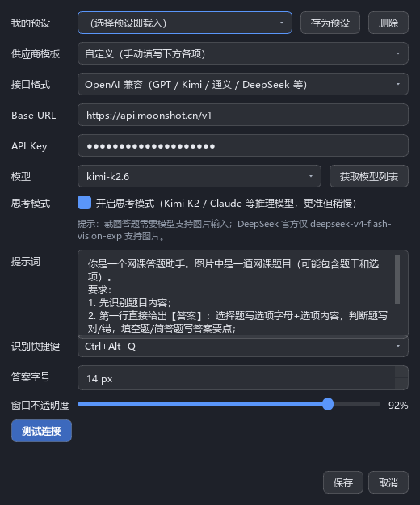

# 设置 · 答题模型

> 路径：主窗口右上角「⚙ 设置」→ 左侧「答题模型」
>
> 这一页配置的是**给题目/问题生成答案的多模态大模型**。截图答题、问答模式的回答、
> 面试模式的回答、资料库生成、面试复盘，全部使用这里配置的模型。

---

## 我的预设

把当前整套配置保存为一个命名预设，方便在多家供应商之间快速切换。

- **存为预设**：为当前填写的配置（接口格式 / Base URL / API Key / 模型 /
  思考模式 / 自动识别间隔 / 三个提示词）命名保存
- **切换预设**：从下拉框选择即整套载入；主窗口标题栏也有预设下拉框，
  选中后自动测试连接；`Ctrl+Alt+S` 顺序切换预设
- **删除**：删除当前选中的预设

> 随预设保存的内容：接口格式、Base URL、API Key、模型、思考模式、
> 自动识别间隔、答题提示词、问答提示词、面试提示词。
> **不随预设**：资料库内容、复盘改进要点、通用页所有设置（透明度/快捷键/沉浸式等）。

## 供应商模板

预置常用供应商，选中后自动填充接口格式和 Base URL：

| 模板 | 接口格式 | Base URL |
| --- | --- | --- |
| Kimi 开放平台 | OpenAI 兼容 | `https://api.moonshot.cn/v1` |
| Kimi for Coding | OpenAI 兼容 | `https://api.kimi.com/coding/v1` |
| DeepSeek | OpenAI 兼容 | `https://api.deepseek.com/v1` |
| 通义千问（阿里云百炼） | OpenAI 兼容 | `https://dashscope.aliyuncs.com/compatible-mode/v1` |
| OpenAI | OpenAI 兼容 | `https://api.openai.com/v1` |
| Anthropic（Claude） | Anthropic | `https://api.anthropic.com` |

其他供应商选「自定义」手动填写即可，只要接口是 OpenAI 兼容或 Anthropic 格式。

## 接口格式

- **OpenAI 兼容**：GPT / Kimi / 通义 / DeepSeek / 硅基流动等绝大多数供应商
- **Anthropic（Claude）**：Claude 官方 API 及兼容服务

## Base URL / API Key

供应商提供的接口地址和密钥。API Key 输入框为密码显示，只保存在本机
`%LOCALAPPDATA%\答题助手\config.json`，不会上传任何地方。

## 模型

- 可手动输入模型名（如 `kimi-k2.6`、`gpt-4o`、`claude-sonnet-4-5`）
- **获取模型列表**：填好 Base URL 和 API Key 后点击，自动拉取该供应商的
  可用模型填入下拉框（能拉到时还会标注是否支持图片输入/推理能力）

> ⚠️ **截图答题要求模型支持图片输入**。DeepSeek 官方仅
> `deepseek-v4-flash-vision-exp` 支持图片；纯问答/面试场景不截图，
> 用纯文本模型（如 `deepseek-chat`）即可。

## 思考模式

默认开启。Kimi K2 / Claude 等推理模型开启后回答更准但更慢。

- 请求时自动按「Kimi 格式 → 通义格式 → 关闭思考」降级重试，
  各家供应商都能兼容，无需关心参数差异
- 普通模型（非推理模型）建议关闭以提速
- **此开关只管**：截图答题、面试复盘、资料库生成等"不赶时间"的任务；
  问答/面试实时场景由「通用 → 实时思考」独立开关控制（默认关，低延迟优先）

## 自动识别间隔（v2.7）

主窗口「🤖 自动」开启后，每隔多少秒自动识别一次框选区域
（5~300 秒，默认 30）。题目未变化会本地跳过、不调用模型。
**随预设保存**，可给不同供应商/场景配不同节奏。

详见 [自动模式需求文档](auto-mode-spec.md)。

## 提示词

发给模型的答题指令，可按题型自定义。默认提示词要求：
先识别题目 → 第一行直接给【答案】→ 第二行起简要理由 → 不输出无关内容。

> 问答模式和面试模式各有独立提示词，在各自卡片页配置，互不影响。

## 测试连接

点击后用当前配置发送一条最小请求（"请只回复：OK"），
验证 Base URL / Key / 模型名 / 思考模式参数是否全部可用。
**建议每次改完配置都点一次**，成功后再开始使用。

---

## 常见问题

**Q：截图答题报错 "模型返回了空答案"？**
多为模型不支持图片输入，或思考模式参数不兼容后的极端情况。
先点「测试连接」，再换一个明确支持图片的模型。

**Q：回答被截断（finish_reason=length）？**
程序已按宽裕值请求并不设过小上限，仍出现说明供应商侧限制较严，
可在提示词中要求"回答尽量精简"。

**Q：想同时用 Kimi 答题 + DeepSeek 面试？**
回答始终由当前激活的这套配置生成。把两家各存为一个预设，
用 `Ctrl+Alt+S` 或标题栏下拉框秒切。
